# Active Directory Domain Services (AD DS) Project

This project showcases the deployment and configuration of a fully functional Active Directory environment for **Saviva Labs**, a fictional organization used to demonstrate real-world IT administration skills.  
The environment includes domain services, organizational structure, user and group management, Group Policy Objects (GPOs), and company-branded configurations.

---

## 📑 Table of Contents

- [🏢 Project Overview](#-project-overview)
- [🖥️ Environment Setup](#environment-setup)
- [🏗️ Active Directory Structure](#active-directory-structure)
- [👥 Users and Groups](#-users-and-groups)
- [🔐 Group Policy Configuration](#-group-policy-configuration)
- [🧩 Skills Demonstrated](#-skills-demonstrated)
- [📸 Project Walkthrough](#-project-walkthrough)
- [🧩 Planned Future Enhancements](#-planned-future-enhancements)
- [📚 Summary](#-summary)

---

## 🏢 Project Overview

This lab simulates how an IT department would build and manage an internal Windows domain for a small-to-mid-sized company.  
All work was performed on a Windows Server hosted in AWS EC2.

Key objectives:

- Deploy Windows Server and promote it to a Domain Controller  
- Create a new AD forest: **savivalabs.local**  
- Build a clean, professional OU structure  
- Create realistic users and security groups  
- Apply domain-wide security policies  
- Configure Saviva-branded login banners  
- Deploy a company shared drive using Group Policy  

This project demonstrates hands-on experience with core enterprise technologies used in Help Desk, IT Support, and SysAdmin roles.

---

## 🖥️ Environment Setup

- **Platform:** AWS EC2  
- **Instance:** Windows Server  
- **Domain:** `savivalabs.local`  
- **Roles Installed:**  
  - Active Directory Domain Services (AD DS)  
  - DNS Server  

---

## 🏗️ Active Directory Structure

### Organizational Units (OUs)

    savivalabs.local
    │
    ├── _Admins
    ├── _Servers
    ├── _Workstations
    ├── _Users
    └── _Groups

This structure keeps administration clean, scalable, and aligned with real-world best practices.

---

## 👥 Users and Groups

### Users Created
- Alice Johnson — Finance  
- Bob Martinez — IT Support  
- Carla Nguyen — HR  
- David Lee — Sales  
- Emily Carter — Marketing  

### Security Groups
- Finance  
- IT Support  
- HR  
- Sales  
- Marketing  

Each user was added to their corresponding departmental group.

---

## 🔐 Group Policy Configuration

### 1. Domain Password Policy  
A custom GPO was created and linked at the domain level to enforce enterprise-grade password standards:

- Minimum length: 12  
- Complexity: Enabled  
- Maximum age: 60 days  
- Minimum age: 1 day  
- Password history: 24 passwords  

---

### 2. Saviva Login Banner  
A branded security notice displayed at logon:

**Title:** Saviva Labs Security Notice  
**Message:**  
“This system is the property of Saviva Labs. Unauthorized access is prohibited.  
All activity may be monitored, logged, and audited.  
By logging in, you acknowledge and accept these terms.”

---

### 3. Saviva Shared Drive Mapping  
A shared folder (`C:\SavivaShared`) was created and deployed to users via GPO:

- Network path: `\\savivalabs.local\SavivaShared`  
- Drive letter: **Z:**  
- Label: **Saviva Shared Drive**

---

## 📸 Screenshots

Included the following screenshots in the repo:

- Domain Controller promotion  
- OU structure  
- User and group creation  
- Group membership  
- Password Policy GPO  
- Saviva Login Banner GPO  
- Login banner in action  
- Shared folder properties  
- Drive mapping GPO configuration  

---

## 🎯 Skills Demonstrated

- Active Directory installation and configuration  
- DNS integration  
- Domain Controller promotion  
- Organizational Unit design  
- User and group administration  
- Group Policy creation and linking  
- Security hardening  
- Network drive deployment  
- AWS EC2 Windows Server management  

---

## 📸 Project Walkthrough

This walkthrough highlights the key stages of deploying Active Directory Domain Services (AD DS) for the Saviva Labs environment. Each screenshot includes a brief explanation to guide the reader through the process.

---

### **1. EC2 Instance Deployment**
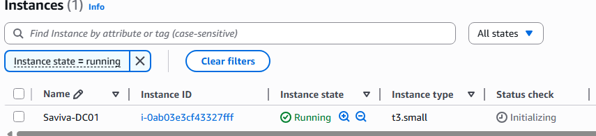  
The Windows Server instance is deployed in AWS and prepared to host the Active Directory environment.

---

### **2. Instance Details**
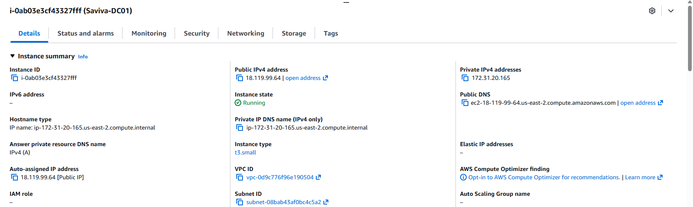  
Instance networking and system details are verified before configuration begins.

---

### **3. RDP Connection**
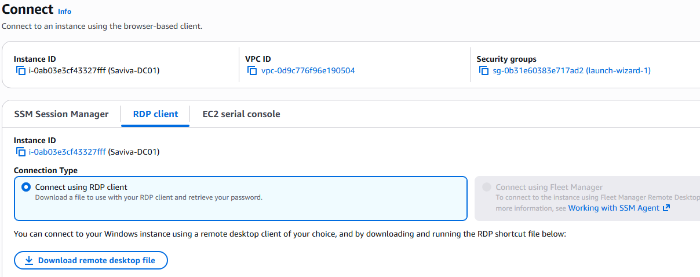  
The RDP connection page provides secure access to the Windows Server instance.

---

### **4. First Login to Windows Server**
  
Successful login confirms the server is ready for role installation and configuration.

---

### **5. Installing Active Directory Domain Services**
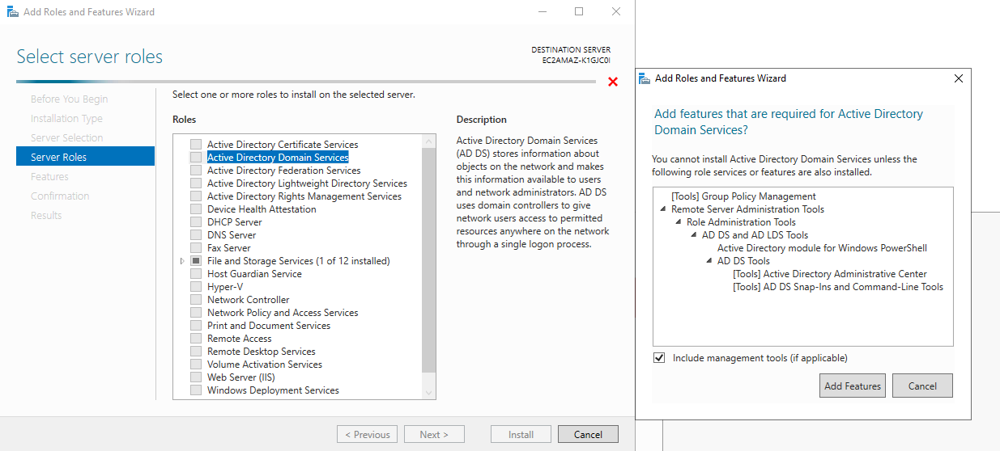  
The AD DS role is added through Server Manager, installing the components required for domain controller promotion.

---

### **6. Confirming AD DS Installation**
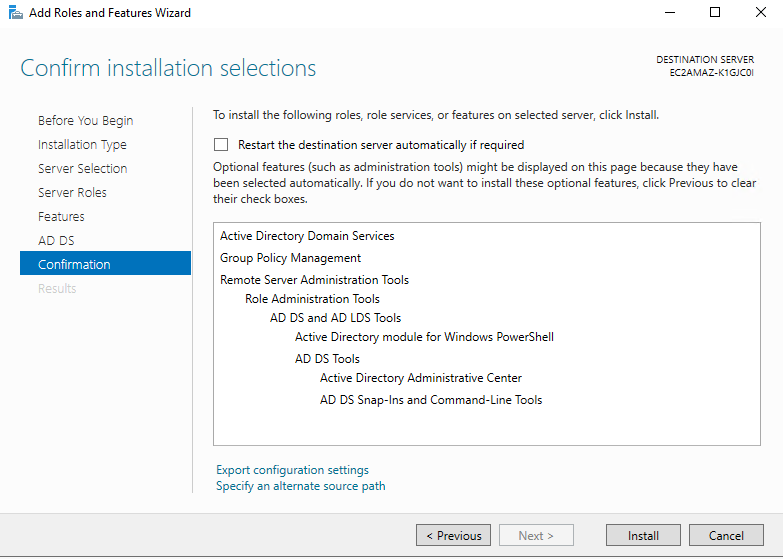  
The installation summary confirms all required features, including Group Policy Management.

---

### **7. Creating the Domain**
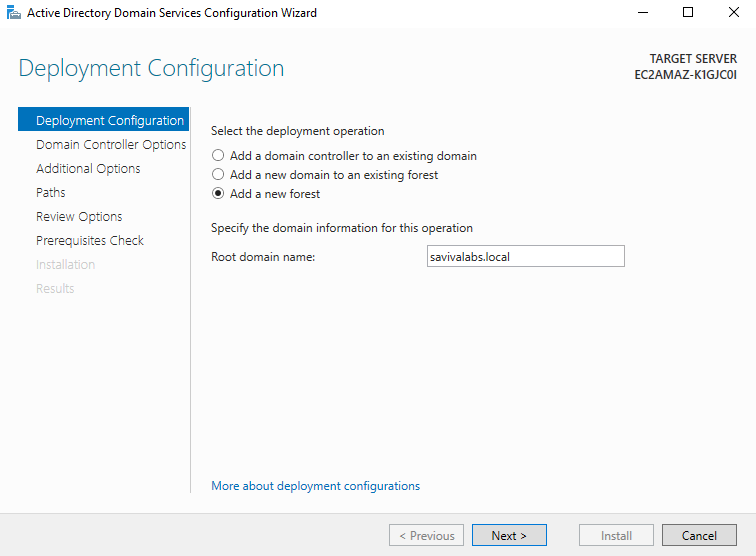  
A new forest is created with the root domain **savivalabs.local**, establishing the foundation of the environment.

---

### **8. Domain Controller Options**
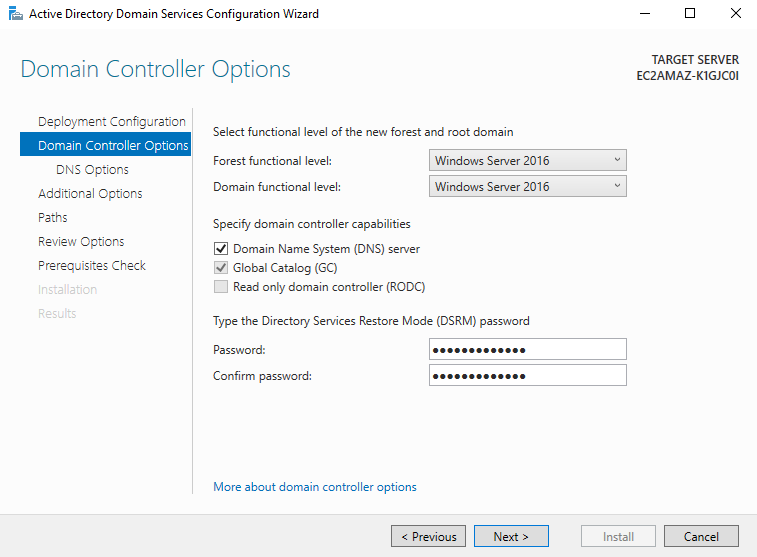  
DNS, Global Catalog, and functional levels are configured, along with the DSRM password.

---

### **9. Prerequisites Check**
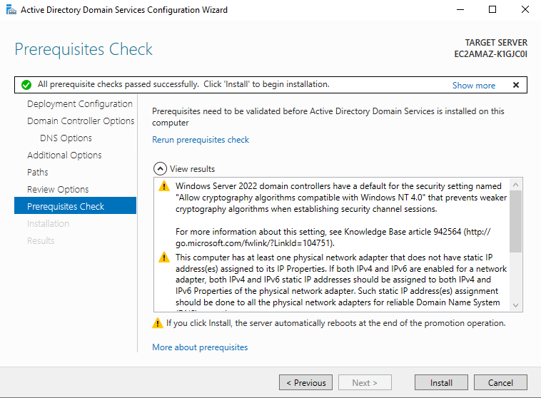  
All prerequisite checks pass successfully, confirming the server is ready for promotion.

---

### **10. Organizational Structure Created**
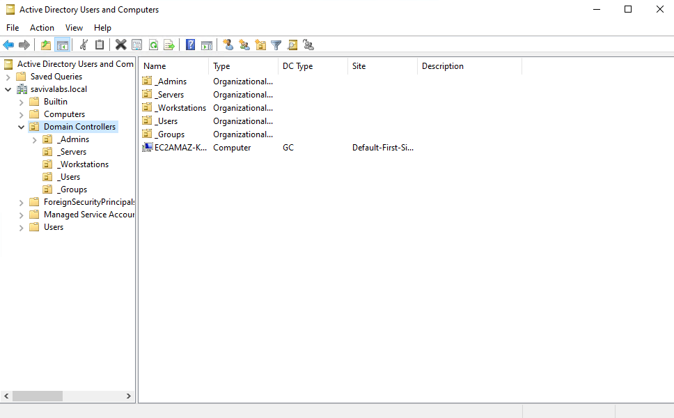  
The Saviva Labs OU structure is created, including Admins, Servers, Workstations, Users, and Groups.

---

### **11. User Accounts Created**
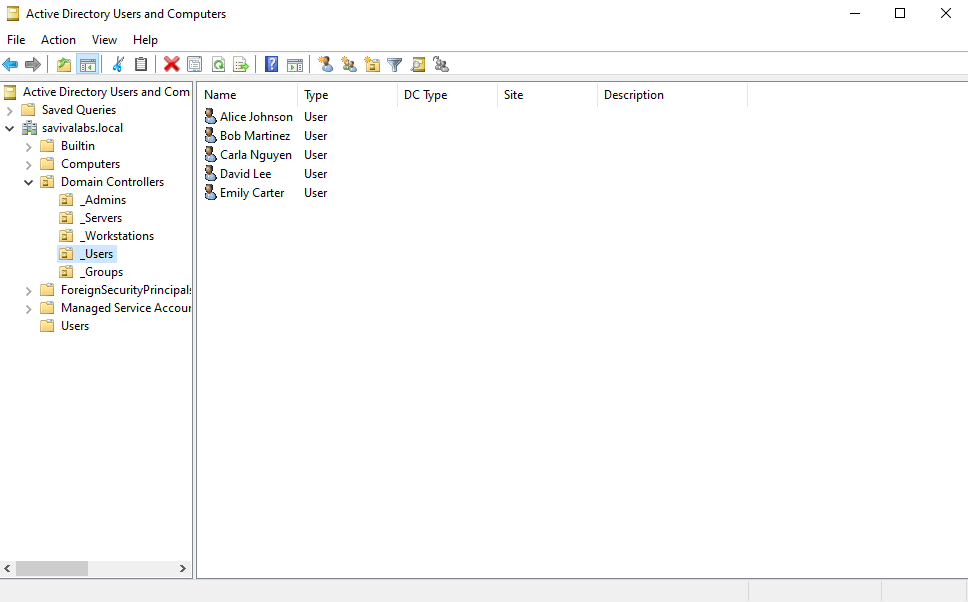  
Realistic user accounts are added to the domain and organized into their respective OUs.

---

### **12. Group Structure + Membership**
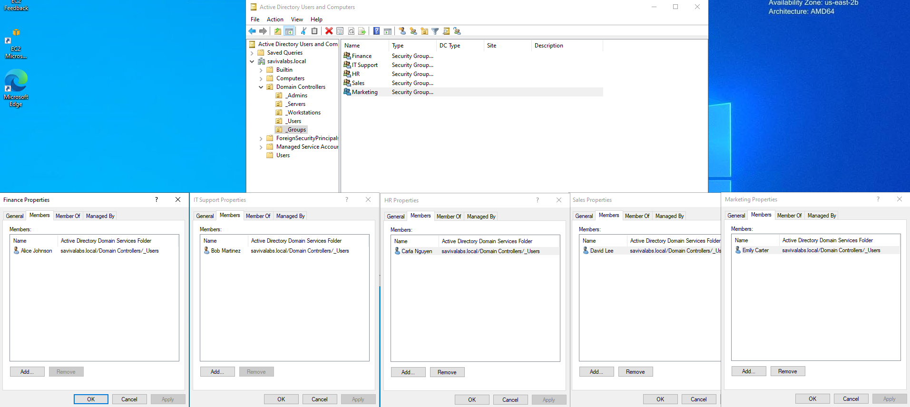  
Security groups are created and users are assigned following least‑privilege principles.

---

## 📁 Full Screenshot Archive
All 25 screenshots are available in the `/screenshots` directory, organized into subfolders for easy navigation.

---

## 🧩 Planned Future Enhancements

- Join Windows 10/11 workstation to the domain  
- File server with NTFS permissions  
- Software deployment via GPO  
- Additional Saviva Labs branding  

---

## 📚 Summary

This project demonstrates the full lifecycle of building and managing an Active Directory environment from scratch.  
It reflects real-world IT administration tasks and showcases the foundational skills required for Help Desk, IT Support, and System Administrator roles.

**Saviva Labs** — Projects by Jacob
